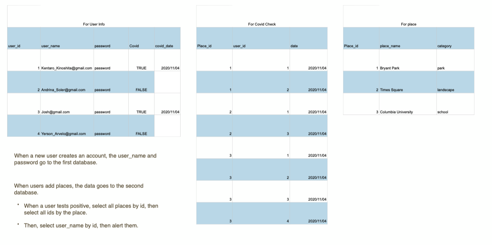

# The Good Samaritan

## Use
- The application allows users to log locations they have visited by date. If a user receives a positive test result for covid 19, they then report it to the app.  
- The app will generate an email list of all users who are at risk for exposure based on their  dated location history.
- This app is for anyone who wants to remain safe from covid and alert others who might be at risk.

## Installation
- To run the development enviornment, clone the project, run the command 
```
> npm install
> node server.js
```
- You might need to read the seed file for places. You can do it by the following command
```
> npx sequelize-cli db:seed:all
```

## Features
- Password protected log in
- Location and date tracking system
- Status reporter 
- Email alert generator

## env vars
- for production set on heroku: https://dashboard.heroku.com/apps/<app-name>/settings -> reveal env vars
- locally: creat a `.env` file with key and value pair in form/url encoding `SECRET_KEY=val`
- connection code on models/index.js: 

## Folder structure


## CI
- travis: travis.io
- code coverage: codacy.com
- monitor on: https://ronerlih.loggly.com/search?terms=tag:heroku&from=-20m&until=now&source_group=&newtab=1#terms=&from=2020-11-07T12:03:00.296Z&until=2020-11-07T13:03:00.296Z&source_group=

## diagram expmles: 


- Database structure Example



## Team 
- Adriana Soler  - Front End Developer
- Josh North - Front End Developer
- Kentaro Kinoshita - Back End Developer
- Yerson Arvelo -Back End Developer

